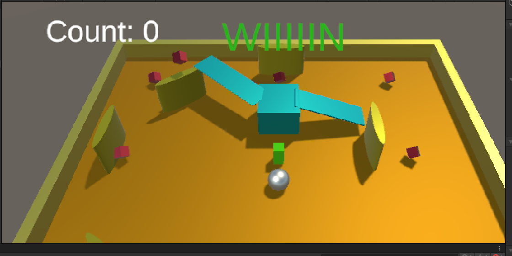
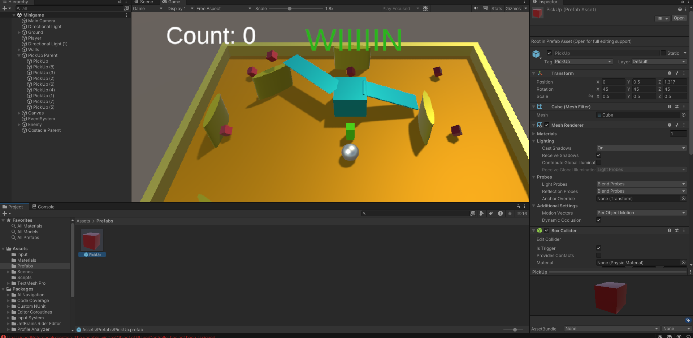
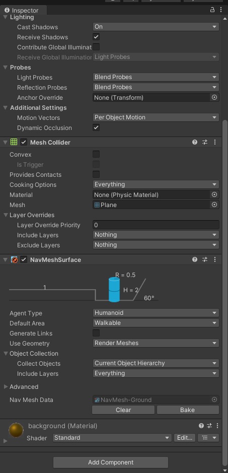
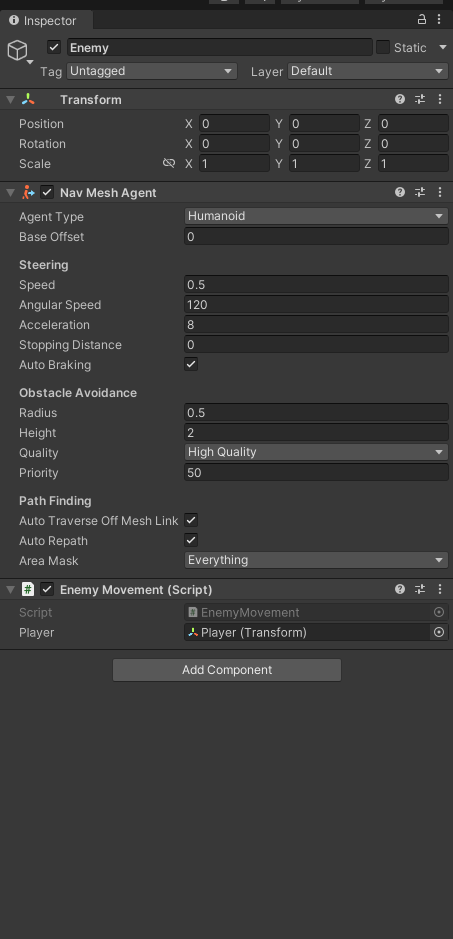

Realización del tutorial de RollABall de Unity

Esta tarea consiste en la entrega de mi resultado haciendo el tutorial antes mencionado

En primer lugar se hizo el script para las mecánicas del jugador.

Añadimos el rigidBody.

     private Rigidbody rb; 

Movimiento en los ejes X e Y

    private float movementX;
    private float movementY;

Contador de puntuaciónç

    private int count;

Velocidad del jugador

    public float speed = 0;

Este metodo carga todo antes de empezar el juego, equivalente al OnCreate de JCompose

    void Start(){
    rb = GetComponent<Rigidbody>();

// Contador de puntuación en la UI

    public TextMeshProUGUI countText;

// Texto de la UI para mostrar si el jugador gana o pierde

    public GameObject winTextObject;

    }

// COntrol de velocidad y colisiones:

    void OnMove(InputValue movementValue)
    {
    Vector2 movementVector = movementValue.Get<Vector2>();

    movementX = movementVector.x;
    movementY = movementVector.y;
    }

    private void OnCollisionEnter(Collision collision)
    {
    if (collision.gameObject.CompareTag("Enemy"))
    {

        Destroy(gameObject); 
    
    winTextObject.gameObject.SetActive(true);
    winTextObject.GetComponent<TextMeshProUGUI>().text = "You Lose!";
        }
        
   
 
    }

A continuación hice los controles de la camara

    public GameObject player;

    // The distance between the camera and the player.
    private Vector3 offset;
    

    // Start is called before the first frame update.
    void Start()
    {
        // Calculate the initial offset between the camera's position and the player's position.
        offset = transform.position - player.transform.position; 
    }

    // LateUpdate is called once per frame after all Update functions have been completed.
    void LateUpdate()
    {
        // Maintain the same offset between the camera and player throughout the game.
        transform.position = player.transform.position + offset;  
    }

Despúes hice los objetivos:

      void Update()
    {
        transform.Rotate (new Vector3 (45,0,0) * Time.deltaTime); 
    }

y finalmente el enemigo y las hitbox
// Reference to the player's transform.
public Transform player;

    private NavMeshAgent navMeshAgent;

    // Start is called before the first frame update.
    void Start()
    {
        // Get and store the NavMeshAgent component attached to this object.
        navMeshAgent = GetComponent<NavMeshAgent>();
    }

    // Update is called once per frame.
    void Update()
    {
        // If there's a reference to the player...
        if (player != null)
        {    
            // Set the enemy's destination to the player's current position.
            navMeshAgent.SetDestination(player.position);
        }
    }

